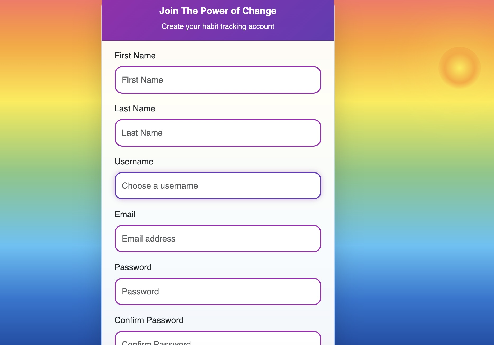

# The Power of Change - Habit Tracker

## What This Project Is About
This is a habit tracker web app that helps people build better daily routines! I built it using Django (a Python web framework) and made it look nice with Bootstrap. Users can sign up, add habits they want to track, and mark them as complete each day.

The app is called "The Power of Change" because small daily habits can lead to big life changes over time.

## Live Links

🌐 **Try the App**: [The Power of Change - Habit Tracker]: https://power-of-change-tracker-3b5b0f9c1685.herokuapp.com/
📂 **View the Code**: [GitHub Repository](https://github.com/MeShell-MyBell/habit-tracker)

## What's in This README
- [What This Project Is About](#what-this-project-is-about)
- [How I Built This](#how-i-built-this)
- [What Users Can Do](#what-users-can-do)
- [User Stories](#user-stories)
- [App Features](#app-features)
- [How I Tested Everything](#how-i-tested-everything)
- [Using AI to Help Build This](#using-ai-to-help-build-this)
- [How to Run This Project](#how-to-run-this-project)
- [Heroku Deployment & Naming](#heroku-deployment--naming)
- [What I Used to Build This](#what-i-used-to-build-this)
- [What I Might Add Next](#what-i-might-add-next)
- [Credits](#credits)

## How I Built This

I used something called "Agile development" - basically breaking the work into small chunks instead of trying to build everything at once. This made it much less overwhelming!

**🔗 [See My Project Planning Board](https://github.com/MeShell-MyBell/habit-tracker/projects)**

### My Planning Process
I used GitHub's project board like a fancy to-do list. I moved tasks through these stages:
- **Backlog**: Cool ideas I might add later
- **To Do**: Tasks ready to work on next  
- **In Progress**: What I'm working on right now
- **Done**: Finished features ✅

### How I Broke Down the Work

**Step 1 - Get the Basics Working**
- Set up Django (the web framework)
- Made user accounts (sign up & log in)
- Built the main habit features (add, view, edit, delete)
- Got it working on the internet (Heroku)

**Step 2 - Make It Better**
- Added categories so people can organize their habits
- Built progress tracking so users can see their streaks
- Made it look good with CSS and Bootstrap
- Fixed bugs and made forms easier to use

**Step 3 - Polish Everything**
- Added password reset (in case people forget their password)
- Made the design look professional
- Set up admin controls
- Tested everything thoroughly

### How I Decided What Was Most Important
I used the MoSCoW method (it's a planning technique):
- **Must Have**: Essential stuff the app needs to work
- **Should Have**: Important features that make it better
- **Could Have**: Nice extras if I had time
- **Won't Have**: Things to maybe add later

This helped me focus on building something that actually worked first, then adding cool features after.

## What Users Can Do

### User Stories
These are short descriptions of what different people want to do with the app:

**Essential Features (Must Have):**
- As someone new to the app, I want to create an account so I can track my personal habits
- As a user, I want to add new habits with different categories so I can organize my goals
- As a user, I want to mark habits as done each day so I can see my progress
- As a user, I want to see all my habits in one place so I know what to work on

**Important Features (Should Have):**
- As a user, I want to edit my habits so I can change my goals as I grow
- As a user, I want to delete habits I no longer want to track
- As a user, I want to see my progress over time so I stay motivated

**Nice-to-Have Features (Could Have):**
- As a user, I want to reset my password if I forget it
- As a user, I want habits organized by category (health, productivity, etc.)

## App Features

Here's what the app actually does:

### Sign Up & Log In

The app has a secure account system:
- **Create Account**: Easy signup form that checks your info
- **Log In**: Simple login that remembers you're logged in
- **Password Reset**: Get an email link if you forget your password
- **Stay Logged In**: The app remembers you until you log out



### Managing Your Habits

The main features for tracking habits:
- **Add New Habits**: Create habits with titles, descriptions, and pick a category
- **View All Habits**: See everything in a clean dashboard with your habit counts
- **Edit Habits**: Change your habit details whenever you need to
- **Delete Habits**: Remove habits you don't want anymore (with a confirmation so you don't delete by accident)

### Habit Categories

I created 8 different categories to help organize habits:
- Health & Fitness (exercise, eat better, etc.)
- Learning & Education (read books, take courses, etc.)
- Productivity (wake up early, plan my day, etc.)
- Personal Development (meditation, journaling, etc.)
- Social & Relationships (call family, meet friends, etc.)
- Hobbies & Creativity (draw, play music, etc.)
- Finance & Career (save money, learn skills, etc.)
- Mindfulness & Wellness (gratitude practice, self-care, etc.)

### Track Your Progress

- **Mark Complete**: Click a button when you complete a habit
- **Visual Feedback**: See clearly which habits are done vs. not done
- **Success Messages**: Get encouraging messages when you complete habits

### Works on All Devices

- **Mobile Friendly**: Works great on phones and tablets
- **Responsive Design**: Looks good on any screen size
- **Touch Friendly**: Easy to tap buttons on mobile

## How I Tested Everything

I made sure the app works properly by testing it in multiple ways:

### Checking the Code Quality

**HTML Testing**: Used online tools to make sure my HTML code is correct
- All pages pass validation ✅
- No broken code or missing tags ✅

**CSS Testing**: Checked that my styling code is valid
- CSS follows best practices ✅
- Works well with Bootstrap ✅

### Testing in Different Browsers
I made sure it works everywhere:
- **Chrome**: ✅ Everything works perfectly
- **Firefox**: ✅ Everything works perfectly
- **Safari**: ✅ Everything works perfectly
- **Edge**: ✅ Everything works perfectly

### Testing on Different Devices
- **Desktop Computer**: ✅ Looks great on big screens
- **Tablet**: ✅ Easy to use with touch
- **Phone**: ✅ All features work on small screens

### Testing All the Features
I manually tested every feature to make sure it works:

**Account Features**
- Signing up with new account ✅
- Logging in and out ✅
- Password reset email system ✅

**Habit Features**
- Adding new habits ✅
- Viewing all habits ✅
- Editing existing habits ✅
- Deleting habits safely ✅
- Marking habits as complete ✅

### Making It Accessible
I made sure people with disabilities can use the app:
- **Good Color Contrast**: Text is easy to read ✅
- **Keyboard Navigation**: Can use the app without a mouse ✅
- **Screen Reader Friendly**: Works with assistive technology ✅

## Using AI to Help Build This

I used AI tools during development to learn faster and write better code:

### How AI Helped Me

**Learning Django**: When I got stuck, AI helped explain Django concepts in simple terms

**Writing Code**: AI suggested code patterns and helped me avoid common mistakes

**Fixing Bugs**: When something broke, AI helped me understand error messages and find solutions

**Planning**: AI helped me organize my ideas and plan the project structure

### AI Tools I Used

1. **GitHub Copilot**: Helped me write code faster by suggesting completions
2. **ChatGPT/Claude**: Answered questions when I was confused about concepts
3. **AI Code Review**: Helped me spot potential problems in my code

### Important Note About AI
While AI was super helpful, I made sure to:
- **Understand every suggestion**: I didn't just copy/paste AI code
- **Test everything**: All AI-suggested code went through the same testing
- **Learn from it**: I used AI as a teaching tool, not a replacement for learning
- **Make my own decisions**: I chose what features to build and how to build them

## How to Run This Project

If you want to run this on your own computer:

### What You Need First
- Python installed on your computer
- Git for downloading the code
- A code editor like VS Code

### Steps to Get It Running

1. **Download the code**
   ```
   git clone https://github.com/MeShell-MyBell/habit-tracker.git
   cd habit-tracker
   ```

2. **Install the required packages**
   ```
   pip install -r requirements.txt
   ```

3. **Set up the database**
   ```
   python manage.py migrate
   ```

4. **Create an admin account**
   ```
   python manage.py createsuperuser
   ```

5. **Start the app**
   ```
   python manage.py runserver
   ```

6. **Open your browser** and go to `http://127.0.0.1:8000`

### How It's Deployed Online
The live version runs on Heroku (a hosting service) and uses:
- **PostgreSQL**: A more powerful database for the live site
- **Gunicorn**: A web server that handles multiple users
- **WhiteNoise**: Serves CSS and image files efficiently

## Heroku Deployment & Naming

### ✅ Is the "habit-tracker" Name Compatible with Heroku?

**Yes!** The repository name "habit-tracker" is fully compatible with Heroku. The project uses correct naming conventions:

- **GitHub Repository**: `habit-tracker` (hyphens) ✅ Heroku compatible
- **Django Project**: `habit_tracker` (underscores) ✅ Python compatible
- **Heroku App Name**: Can use any name with lowercase letters, numbers, and hyphens

### Heroku Naming Rules:
✅ **Allowed**: lowercase letters, numbers, hyphens (-)
❌ **Not Allowed**: uppercase, underscores (_), spaces, special characters

### Example Valid Heroku App Names:
- `habit-tracker`
- `my-habit-tracker`
- `habit-tracker-app`
- `power-of-change-tracker-3b5b0f9c1685` (current deployment)

**📖 For detailed information**, see the [Heroku Naming Compatibility Guide](HEROKU_NAMING_COMPATIBILITY.md)

**🚀 For deployment instructions**, see the [Heroku Deployment Guide](HEROKU_DEPLOYMENT_GUIDE.md)

## What I Used to Build This

**Main Programming Stuff:**
- **Python**: The main programming language
- **Django**: Web framework that handles the backend
- **HTML/CSS**: For the webpage structure and styling
- **JavaScript**: For interactive features
- **Bootstrap**: CSS framework that makes things look professional

**Database:**
- **SQLite**: Simple database for development
- **PostgreSQL**: More powerful database for the live site

**Tools & Services:**
- **VS Code**: Code editor
- **Git & GitHub**: For saving and sharing code
- **Heroku**: Hosting service for the live app

## What I Might Add Next

Ideas for making the app even better:
- **Habit Streaks**: Show how many days in a row you've completed a habit
- **Progress Charts**: Visual graphs showing your progress over time
- **Reminders**: Email notifications to remind you about your habits
- **Social Features**: Share achievements with friends
- **Mobile App**: A native phone app version

## Credits

**Learning Resources:**
- Django official documentation (helped me understand how Django works)
- Bootstrap documentation (for making it look good)
- Code Institute course materials (my main learning source)
- Stack Overflow community (for solving specific problems)

**Special Thanks:**
- My Code Institute mentors for guidance
- The Django community for creating such a great framework
- Everyone who tested the app and gave feedback

---

Thanks for checking out my habit tracker project! If you have any questions about the code or want to suggest improvements, feel free to reach out.

[Back to Top](#the-power-of-change---habit-tracker)


